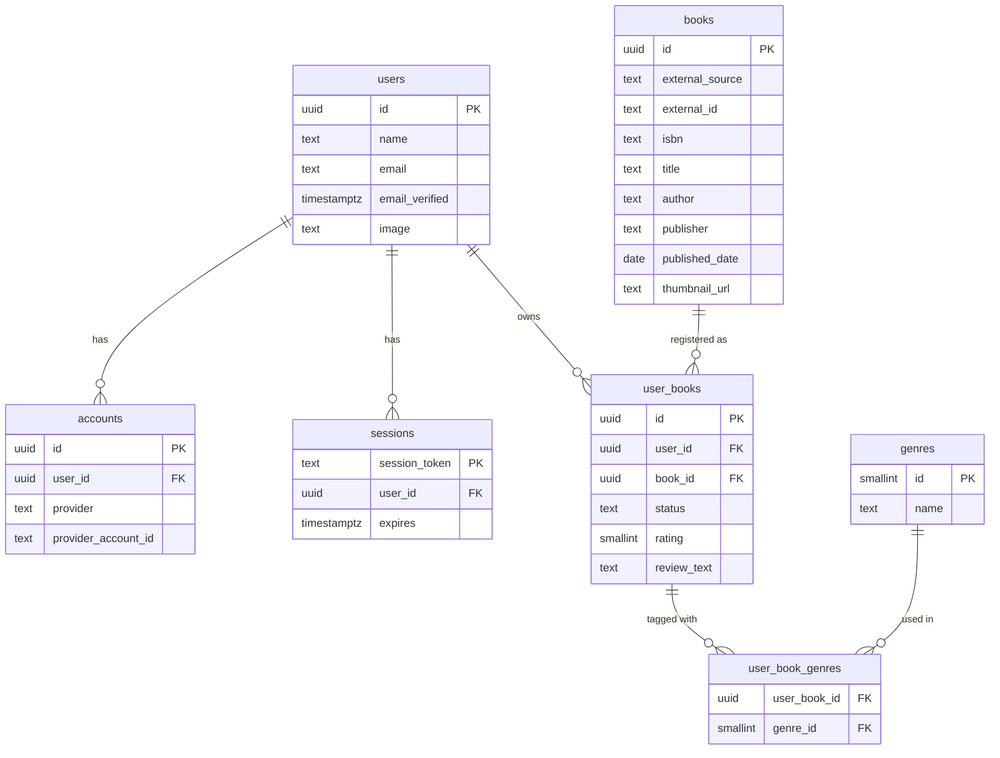

# 本棚アプリ DB設計書

- 作成日: 2026-10-02
- 対象DB: PostgreSQL（Vercel Marketplace経由の Neon）
- 関連ドキュメント: [docs/requirements.md](./requirements.md)

## 1. ER図

## 2. テーブル定義

### 2.1 users（Auth.js管理テーブル）

Auth.js（NextAuth）のPostgresアダプタが要求する標準スキーマ。Googleログインのみ使用するためパスワード関連カラムは持たない。

| カラム名 | 型 | NULL | デフォルト | 説明 |
|---|---|---|---|---|
| id | uuid | NOT NULL | gen_random_uuid() | 主キー |
| name | text | NULL | - | Googleアカウントの表示名 |
| email | text | NOT NULL | - | メールアドレス |
| email_verified | timestamptz | NULL | - | メール確認日時（OAuthログインでは自動設定） |
| image | text | NULL | - | プロフィール画像URL |

- 制約: `UNIQUE (email)`

### 2.2 accounts（Auth.js管理テーブル）

OAuthプロバイダ（Google）との連携情報を保持する。

| カラム名 | 型 | NULL | デフォルト | 説明 |
|---|---|---|---|---|
| id | uuid | NOT NULL | gen_random_uuid() | 主キー |
| user_id | uuid | NOT NULL | - | users.id への外部キー |
| type | text | NOT NULL | - | "oauth" 固定 |
| provider | text | NOT NULL | - | "google" 固定 |
| provider_account_id | text | NOT NULL | - | Google側のアカウントID |
| refresh_token | text | NULL | - | OAuthリフレッシュトークン |
| access_token | text | NULL | - | OAuthアクセストークン |
| expires_at | bigint | NULL | - | アクセストークン有効期限 |
| token_type | text | NULL | - | - |
| scope | text | NULL | - | - |
| id_token | text | NULL | - | - |

- 制約: `UNIQUE (provider, provider_account_id)`
- 外部キー: `user_id REFERENCES users(id) ON DELETE CASCADE`
- 実装メモ: `refresh_token`〜`session_state`の6カラムは、Drizzleスキーマ上もTSのプロパティ名をsnake_caseのままにしている（`@auth/drizzle-adapter`の型定義がこの命名を前提にしているため。NextAuth v4時代からの命名を引き継いだ、アダプタ側の歴史的な仕様）。

### 2.3 sessions（Auth.js管理テーブル）

| カラム名 | 型 | NULL | デフォルト | 説明 |
|---|---|---|---|---|
| session_token | text | NOT NULL | - | セッショントークン（主キー） |
| user_id | uuid | NOT NULL | - | users.id への外部キー |
| expires | timestamptz | NOT NULL | - | セッション有効期限 |

- 主キー: `session_token`（独立したid列は持たない。`@auth/drizzle-adapter`が「session_token自体が主キー」という前提の設計のため）
- 外部キー: `user_id REFERENCES users(id) ON DELETE CASCADE`

### 2.4 books（アプリ独自テーブル）

外部API（楽天ブックス／Google Books）から取得した書籍情報のキャッシュ。同じ本を複数ユーザーが登録しても1レコードを共有する。

| カラム名 | 型 | NULL | デフォルト | 説明 |
|---|---|---|---|---|
| id | uuid | NOT NULL | gen_random_uuid() | 主キー |
| external_source | text | NOT NULL | - | `'rakuten'` または `'google'` |
| external_id | text | NOT NULL | - | 取得元APIにおける書籍ID |
| isbn | text | NULL | - | ISBN（取得できた場合） |
| title | text | NOT NULL | - | タイトル |
| author | text | NULL | - | 著者名 |
| publisher | text | NULL | - | 出版社 |
| published_date | date | NULL | - | 出版日 |
| thumbnail_url | text | NULL | - | 表紙画像URL |
| created_at | timestamptz | NOT NULL | now() | 作成日時 |

- 制約: `CHECK (external_source IN ('rakuten', 'google'))`
- 制約: `UNIQUE (external_source, external_id)`（同じ本の重複登録防止）

### 2.5 user_books（アプリ独自テーブル）

ユーザーの本棚登録情報（ステータス・評価・感想）。

| カラム名 | 型 | NULL | デフォルト | 説明 |
|---|---|---|---|---|
| id | uuid | NOT NULL | gen_random_uuid() | 主キー |
| user_id | uuid | NOT NULL | - | users.id への外部キー |
| book_id | uuid | NOT NULL | - | books.id への外部キー |
| status | text | NOT NULL | `'want_to_read'` | `'want_to_read'` / `'reading'` / `'finished'` |
| rating | smallint | NULL | - | 星評価（1〜5） |
| review_text | text | NULL | - | 自由記述の感想文 |
| created_at | timestamptz | NOT NULL | now() | 作成日時 |
| updated_at | timestamptz | NOT NULL | now() | 更新日時 |

- 制約: `CHECK (status IN ('want_to_read', 'reading', 'finished'))`
- 制約: `CHECK (rating IS NULL OR (rating BETWEEN 1 AND 5))`
- 制約: `UNIQUE (user_id, book_id)`（同じ本を同一ユーザーが重複登録するのを防止）
- 外部キー: `user_id REFERENCES users(id) ON DELETE CASCADE`
- 外部キー: `book_id REFERENCES books(id) ON DELETE RESTRICT`

### 2.6 genres（アプリ独自テーブル・固定マスタ）

開発者がマイグレーション／シードデータで管理する固定ジャンルマスタ。

| カラム名 | 型 | NULL | デフォルト | 説明 |
|---|---|---|---|---|
| id | smallint | NOT NULL | - | 主キー（シード投入時に固定値で採番） |
| name | text | NOT NULL | - | ジャンル名 |

- 制約: `UNIQUE (name)`
- 初期シードデータ: `小説` / `ビジネス` / `自己啓発` / `技術書` / `エッセイ` / `その他`

### 2.7 user_book_genres（アプリ独自テーブル・中間テーブル）

1冊の本に複数ジャンルを設定できるようにする多対多の中間テーブル。

| カラム名 | 型 | NULL | デフォルト | 説明 |
|---|---|---|---|---|
| user_book_id | uuid | NOT NULL | - | user_books.id への外部キー |
| genre_id | smallint | NOT NULL | - | genres.id への外部キー |

- 主キー: `PRIMARY KEY (user_book_id, genre_id)`
- 外部キー: `user_book_id REFERENCES user_books(id) ON DELETE CASCADE`
- 外部キー: `genre_id REFERENCES genres(id) ON DELETE RESTRICT`

## 3. インデックス設計

| テーブル | インデックス | 目的 |
|---|---|---|
| user_books | `idx_user_books_user_id (user_id)` | 本棚一覧（ユーザー単位の絞り込み）の高速化 |
| user_books | `idx_user_books_user_id_status (user_id, status)` | ステータス別フィルタの高速化 |
| user_book_genres | `idx_user_book_genres_genre_id (genre_id)` | ジャンル別フィルタの高速化 |
| books | `idx_books_external (external_source, external_id)` | UNIQUE制約と兼用、重複チェック高速化 |
| accounts | `idx_accounts_provider (provider, provider_account_id)` | UNIQUE制約と兼用、Auth.jsログイン時の検索高速化 |
| sessions | `idx_sessions_token (session_token)` | UNIQUE制約と兼用、セッション検証の高速化 |

## 4. 設計方針・補足

- **ORMはDrizzleを採用**（実装済み）。当初Prismaを検討したが、インストールされたバージョンがPrisma独自のホスティング基盤(Prisma Compute/Platform)前提の破壊的変更が大きいプレリリース版だったため、プレーンなPostgres接続文字列でそのまま使えるDrizzleに変更した。
- **users / accounts / sessions** はAuth.js（NextAuth）のPostgresアダプタ標準スキーマに準拠する。Drizzle用の公式アダプタ `@auth/drizzle-adapter` を使う想定。
- **books** は外部APIのレスポンスをキャッシュする目的のテーブル。同じ本を複数ユーザーが登録しても `books` テーブルには1件のみ保持し、ユーザーごとの情報（ステータス・評価・感想・ジャンル）は `user_books` / `user_book_genres` 側に持たせる正規化設計。
- 主キーは `genres`（固定マスタ、件数少）を除き全て `UUID`（`gen_random_uuid()`）を採用し、Auth.jsの標準スキーマと一貫性を持たせる。
- `user_books.book_id` の削除制約は `ON DELETE RESTRICT` とし、本棚に登録されている本がうっかり削除されることを防ぐ（本の削除機能自体は現時点で要件に含まれない）。

## 5. 実装ファイルの対応

実際のスキーマ定義・マイグレーションは以下のファイルで管理する。

| ファイル | 役割 |
|---|---|
| `db/schema.ts` | テーブル定義の実体（このドキュメントの2章をTypeScriptコード化したもの） |
| `drizzle.config.ts` | `drizzle-kit`（マイグレーション生成・適用CLI）の設定 |
| `drizzle/*.sql` | `db/schema.ts` の変更から自動生成されるマイグレーションSQL（Git管理対象） |
| `db/index.ts` | アプリ実行時に使うDBクライアント |
| `db/seed.ts` | ジャンル等の初期データ投入スクリプト（`npm run db:seed`） |

スキーマを変更する時の流れ: `db/schema.ts` を編集 → `npm run db:generate` でSQL差分を生成 → `npm run db:migrate` でNeonに適用。
